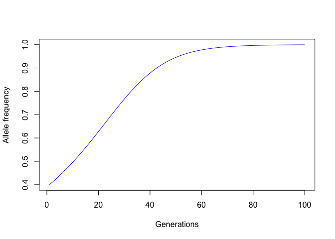

2. Function for deterministc simulations


```r
det_sim <- function(p = 0.6, A = 1.0, a = 1.1, Aa = 1.0, iter = 100) {
  iter <- as.numeric(iter)
  q_val <- c((1 - p), rep(0, iter-1))
  p_val <- c(p, rep(0, iter-1))
  for (i in 1:(iter-1)) {
    w_bar <- (p ^ 2 * A) + ((1 - p)^2 * a) + 2 * p * (1 - p) * Aa
    p <- (A  / w_bar * (p ^ 2)) + (p * (1 - p) )* Aa / w_bar
    q_val[i+1] <- (1 - p)
    p_val[i+1] <- p
  }
  if (as.numeric(A) > as.numeric(a)) {
    plot(p_val, type = "l", col = "blue", 
         xlab = "Generations", ylab = "Allele frequency")
  } else {
    plot(q_val, type = "l", col = "blue", 
         xlab = "Generations", ylab = "Allele frequency")
  }
}
det_sim()
```

<!-- -->
