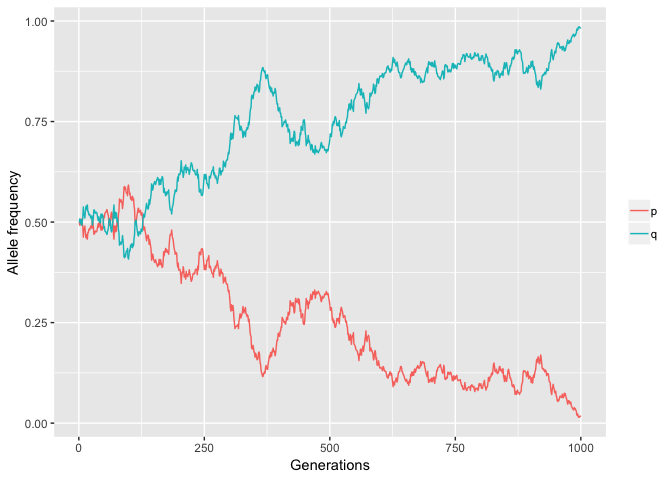
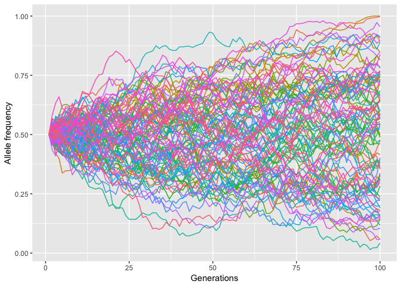

2. Function for deterministic simulations


```r
det_sim <- function(p = 0.6, A = 1.0, a = 1.1, Aa = 1.0, iter = 100) {
  q_val <- c((1 - p), rep(0, iter - 1))
  p_val <- c(p, rep(0, iter - 1))
  for (i in 1:(iter - 1)) {
    w_bar <- (p ^ 2 * A) + ((1 - p) ^ 2 * a) + 2 * p * (1 - p) * Aa
    p <- (A  / w_bar * (p ^ 2)) + (p * (1 - p)) * Aa / w_bar
    q_val[i + 1] <- (1 - p)
    p_val[i + 1] <- p
  }
  if (as.numeric(A) > as.numeric(a)) {
    adv <- p_val[length(p_val)]
    plot(p_val, type = "l", col = "blue", 
         xlab = "Generations", ylab = "Allele frequency")
  } else {
    adv <- q_val[length(q_val)]
    plot(q_val, type = "l", col = "blue", 
         xlab = "Generations", ylab = "Allele frequency")
  }
  if (adv == 1) {
    cat("Allele is fixed, at:", adv)
  } else {
    cat("Allele is not fixed, at:", adv)
  }
}
det_sim()
```

<!-- -->

```
## Allele is not fixed, at: 0.9994784
```

3. Genetic drift simulation


```r
set.seed(12)
library(ggplot2)
library(reshape2)
gen_drifto <- function(p = 0.5, pop = 1000, iter = 1000) {
  p_val <- c((p), rep(0, iter - 1))
  q_val <- c((1 - p), rep(0, iter - 1))
  for (i in 1:(iter)) {
    sample_data <- sample(c("A", "a"), size = 2 * pop, rep = T, prob = c(p, 1 - p))
    p <- length(sample_data[sample_data == "A"]) / (2 * pop)
    p_val[i] <- p
    q_val[i] <- 1 - p
  }
  data <- rbind(p_val, q_val)
  data <- t(data)
  colnames(data) <- c("p", "q")
  data_m <- melt(data)
  ggplot(data_m, aes(x = Var1, y = value, col = factor(Var2))) +
    geom_line() + labs(x = "Generations", y = "Allele frequency") +
    theme(legend.title = element_blank())
}
gen_drifto()
```

<!-- -->

4. Calculating the likelihood of an allele being lost


```r
gen_drifto2 <- function(p = 0.5, pop = 1000, iter = 1000) {
  p_val <- c((p), rep(0, iter - 1))
  q_val <- c((1 - p), rep(0, iter - 1))
  for (i in 1:(iter)) {
    sample_data <- sample(c("A", "a"), size = 2 * pop, rep = T, prob = c(p, 1 - p))
    p <- length(sample_data[sample_data == "A"]) / (2 * pop)
    p_val[i] <- p
    q_val[i] <- 1 - p
  }
  if (p_val[length(p_val)] == 0 ) {
    return(length(p_val[p_val == 0])/length(p_val))
  } else if (q_val[length(q_val)] == 0 ) {
    return(length(q_val[q_val == 0])/length(q_val))
  } else {
    return("Allele not lost at the end of simulation")
  }
}
gen_drifto2(0.5, 200, 1000)
```

```
## [1] 0.688
```

```r
gen_drifto2(0.25, 200, 1000)
```

```
## [1] 0.502
```

```r
gen_drifto2(0.1, 200, 1000)
```

```
## [1] 0.61
```

5. Keeping track of allele frequencies.


```r
gen_drifto3 <- function(p = 0.5, pop = 1000, iter = 100) {
  p_val <- c((p), rep(0, iter - 1))
  q_val <- c((1 - p), rep(0, iter - 1))
  for (i in 1:(iter)) {
    sample_data <- sample(c("A", "a"), size = 2 * pop, rep = T, prob = c(p, 1 - p))
    p <- length(sample_data[sample_data == "A"]) / (2 * pop)
    p_val[i] <- p
    q_val[i] <- 1 - p
  }
  return(p_val)
}
draw_sims <- function(iter = 100) {
  dat <- list()
  for (i in 1:iter) {
    samples <- unlist(gen_drifto3())
    dat <- rbind(unlist(dat), samples)
  }
  colnames(dat) <- c(1:100)
  dat <- as.data.frame(dat)
  dat <- melt(t(dat))
  dat
  ggplot(dat, aes(x = Var1, y = value, color = factor(Var2))) + geom_line() +
    labs(x = "Generations", y = "Allele frequency") +
    theme(legend.position="none")
}
draw_sims()
```

<!-- -->
