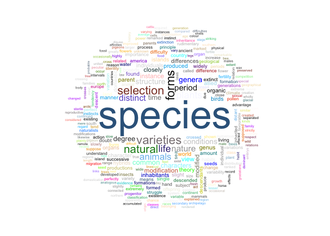

```r
library(stringr)
library(stringi)
library(tidytext)
```

**How might you get `writeLines` to print each string on a newline?**


```r
fly_seq <- c(A = "ACTGGCCA", B = "ACTGGCCT", C = "ACTGTCCA" )
cat(fly_seq, sep ="\n")
```

```
## ACTGGCCA
## ACTGGCCT
## ACTGTCCA
```

**Make a single string that looks like "x1 + x2 + x3 + x4 + x5" using `paste` or for stringi it is `stri_join()` and `str_c` in `stringr` **


```r
paste("x", 1:5, sep = "", collapse = " + ")
```

```
## [1] "x1 + x2 + x3 + x4 + x5"
```


**I have created an object of DNA sequences called "seqs" how long is each sequence? How many sequences are there? `nchar()` in base, and `str_length()`**


```r
nchar(seqs)
```

```
##  [1] 80 74 78 74 76 78 79 80 84 73 77 79 80 82 81 79 79 84 78 79
```

```r
length(seqs)
```

```
## [1] 20
```

**Words in the origin of species**


```r
library(gutenbergr)
library(tidyverse)

books <- gutenberg_works(grepl(title, 
                               pattern = "On the origin of species",
                         ignore.case = TRUE))

species <- gutenberg_download(1228)
str(species)
```

```
## Classes 'tbl_df', 'tbl' and 'data.frame':	15819 obs. of  2 variables:
##  $ gutenberg_id: int  1228 1228 1228 1228 1228 1228 1228 1228 1228 1228 ...
##  $ text        : chr  "ON THE ORIGIN OF SPECIES." "" "OR THE PRESERVATION OF FAVOURED RACES IN THE STRUGGLE FOR LIFE." "" ...
```

```r
head(species$text)
```

```
## [1] "ON THE ORIGIN OF SPECIES."                                      
## [2] ""                                                               
## [3] "OR THE PRESERVATION OF FAVOURED RACES IN THE STRUGGLE FOR LIFE."
## [4] ""                                                               
## [5] ""                                                               
## [6] "By Charles Darwin, M.A.,"
```

```r
species_text <- species$text
```

**How many lines are empty, check using the `stri_isempty`. What proportion of lines is this?**


```r
empty <- stri_isempty(species_text)
mean(empty)
```

```
## [1] 0.09121942
```

**How often does the word introduction appear? Use `grep` or `str_subset`**


```r
grep(species_text, pattern = "introduction", ignore.case= T)
```

```
## [1]    49   275  2311  9344  9526 10970
```

**How would you check the lines?**


```r
for (x in grep(species_text, pattern = "introduction", ignore.case= T)) {
  print(species_text[x])
}
```

```
## [1] "  INTRODUCTION."
## [1] "INTRODUCTION."
## [1] "potent has been the effect of the introduction of a single tree, nothing"
## [1] "that the horse, since its introduction by the Spaniards into South"
## [1] "species, their extinction, and the introduction of new ones, cannot be"
## [1] "intermediate torrid regions. In the admirable 'Introduction to the Flora"
```

Let's use slice in dplyr to remove introduction and INDEX as follows (or really just keeping everything in between)


```r
species_slice <- species %>%
  slice(grep("^INTRODUCTION\\.", text):(grep("^INDEX\\.", text))-1)
```

**Identifying chapters**

Each chapter begins like this "1. VARIATION UNDER DOMESTICATION". Can you identify a regular expression that matches this?


```r
grep("^[0-9]+\\.", species_slice$text, value=TRUE)
```

```
##  [1] "1. VARIATION UNDER DOMESTICATION."                   
##  [2] "2. VARIATION UNDER NATURE."                          
##  [3] "3. STRUGGLE FOR EXISTENCE."                          
##  [4] "4."                                                  
##  [5] "5. LAWS OF VARIATION."                               
##  [6] "6. DIFFICULTIES ON THEORY."                          
##  [7] "7. INSTINCT."                                        
##  [8] "8. HYBRIDISM."                                       
##  [9] "9. ON THE IMPERFECTION OF THE GEOLOGICAL RECORD."    
## [10] "10. ON THE GEOLOGICAL SUCCESSION OF ORGANIC BEINGS." 
## [11] "11. GEOGRAPHICAL DISTRIBUTION."                      
## [12] "12. GEOGRAPHICAL DISTRIBUTION--continued."           
## [13] "13. MUTUAL AFFINITIES OF ORGANIC BEINGS: MORPHOLOGY:"
## [14] "14. RECAPITULATION AND CONCLUSION."
```


**removing blank lines etc...**

Use nzchar (which returns FALSE is the string is empty) to find empty lines


```r
length(species_slice$text)
```

```
## [1] 13940
```

```r
sum(nzchar(species_slice$text))
```

```
## [1] 13138
```

**We can filter on those lines. Fill in the missing parts.**


```r
species_filtered <- species %>%
  slice(grep("^INTRODUCTION\\.", text):(grep("^INDEX\\.", text))-1) %>%
  filter(nzchar(text)) %>%
  mutate(linenumber = row_number(),
         chapter = cumsum(grepl("^[0-9]+\\.", text)))
```

**`tidytext`**
We could continue to make all of the changes by ourselves, but let's use tidytext to help us


```r
species_tidy <- species_filtered %>%
    unnest_tokens(word, text)
```

Now we remove "stop words"


```r
species_tidy <- species_tidy %>%
  anti_join(stop_words)
```

```
## Joining, by = "word"
```

**Find the most common words in the book?**


```r
species_count <- species_tidy %>% count(word) %>% arrange(desc(n))
species_count
```

```
## # A tibble: 6,438 x 2
##    word          n
##    <chr>     <int>
##  1 species    1489
##  2 forms       397
##  3 varieties   396
##  4 selection   383
##  5 natural     361
##  6 life        298
##  7 plants      297
##  8 animals     280
##  9 distinct    255
## 10 nature      251
## # ... with 6,428 more rows
```

**How about a word cloud of the top 50 words**


```r
library(wordcloud)
set.seed(57)
ran_col <- sample(colors(), size = 300)
wordcloud(species_count$word, species_count$n, max.words=300, min.freq=30 ,random.color=T, colors = ran_col, scale=c(5,.3), random.order = F)
```

<!-- -->


