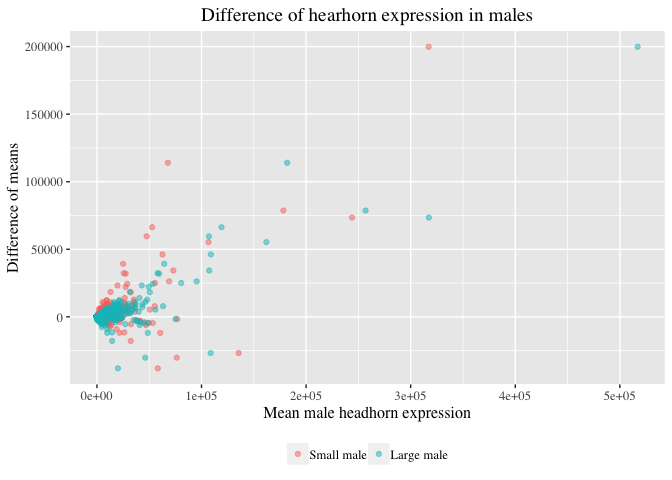
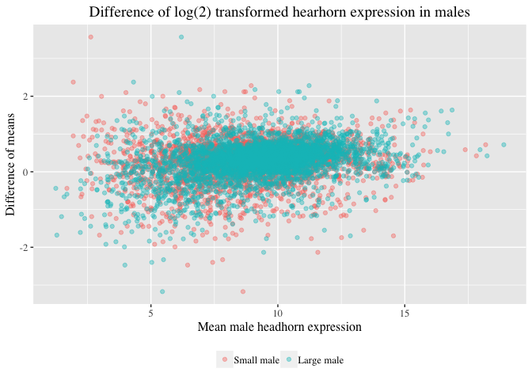

2. Read `.csv` file.

```r
rna_counts <- as.data.frame(read.csv("~/Documents/R/Bio720/eXpress_dm_counts.csv", header = T, row.names=1))
mean_exp <- function(dat, col, log = F) {
  if (log) {
    dat[dat == 0 ] <- NA
    my_mean <- mean(log2(dat[,col]), na.rm = T)
  } else {
    my_mean <- mean(dat[,col])
  }
  return(my_mean)
}
mean_exp(rna_counts, 3, log = T)
```

```
## [1] 8.314916
```

```r
mean_exp(rna_counts, 23, log = F)
```

```
## [1] 1950.561
```
3. Iterative application of `mean_exp` over all columns.

```r
# pre-allocate vector of 0's
my_vec_val <- c(numeric(ncol(rna_counts))) 
my_vec_name <- c(numeric(ncol(rna_counts)))
for (col in 1:ncol(rna_counts)) {
  name <- colnames(rna_counts)[col]
#  logged <- mean_exp(rna_counts, name, log = T)
  unlogged <- mean_exp(rna_counts, name, log = F)
  my_vec_val[col] <- unlogged
  my_vec_name[col] <- name
#  cat(c(name, logged, unlogged), sep = "\t")
}
names(my_vec_val) <- my_vec_name
head(my_vec_val)
```

```
##  F101_lg_female_hdhorn F101_lg_female_thxhorn   F101_lg_female_wings 
##               1978.847               1983.250               1583.904 
##  F105_lg_female_hdhorn F105_lg_female_thxhorn   F105_lg_female_wings 
##               2105.712               1433.749               1869.962
```
4. Using `apply()` to iterate over data frame instead of a loop.

```r
head(apply(rna_counts, 2, mean))
```

```
##  F101_lg_female_hdhorn F101_lg_female_thxhorn   F101_lg_female_wings 
##               1978.847               1983.250               1583.904 
##  F105_lg_female_hdhorn F105_lg_female_thxhorn   F105_lg_female_wings 
##               2105.712               1433.749               1869.962
```
Comparing the speed of two methods using `system.time`

```r
system.time({apply(rna_counts, 2, mean)})
```

```
##    user  system elapsed 
##   0.010   0.000   0.009
```

```r
system.time({
  my_vec_val <- c(numeric(ncol(rna_counts))) 
my_vec_name <- c(numeric(ncol(rna_counts)))
for (col in 1:ncol(rna_counts)) {
  name <- colnames(rna_counts)[col]
  unlogged <- mean_exp(rna_counts, name, log = F)
  my_vec_val[col] <- unlogged
  my_vec_name[col] <- name
}
names(my_vec_val) <- my_vec_name
})
```

```
##    user  system elapsed 
##   0.011   0.000   0.011
```
5. Doing it in a more R-ish way...

```r
head(colMeans(rna_counts))
```

```
##  F101_lg_female_hdhorn F101_lg_female_thxhorn   F101_lg_female_wings 
##               1978.847               1983.250               1583.904 
##  F105_lg_female_hdhorn F105_lg_female_thxhorn   F105_lg_female_wings 
##               2105.712               1433.749               1869.962
```

```r
system.time({colMeans(rna_counts)})
```

```
##    user  system elapsed 
##   0.002   0.000   0.002
```
6. Calculating the means of the rows

```r
my_row_means <- function(dat, row, log = F) {
  if (log) {
    dat[dat == 0 ] <- NA
    my_row_mean <- rowMeans(log2(dat[row,]), na.rm = T)
  } else {
    my_row_mean <- rowMeans(dat)
  }
  return(my_row_mean)
}
head(my_row_means(rna_counts, 4, log = T))
```

```
## FBpp0077879 
##    5.399504
```
7. Calculating the means of small and large male headhorns

```r
library(dplyr)
rna_counts[rna_counts == 0 ] <- NA
rna_counts <- na.omit(rna_counts)
my_sm <- rna_counts %>% select(contains("sm_male_hdhorn"))
my_sm_mean <- rowMeans(my_sm, na.rm=T)
my_lg <- rna_counts %>% select(contains("lg_male_hdhorn"))
my_lg_mean <- rowMeans(my_lg, na.rm=T)
```
Calculating the difference of means

```r
my_diff <- my_lg_mean - my_sm_mean
```
8. Plot the expression of each gene

```r
library(ggplot2)
library(reshape2)
my_dat <- as.data.frame(cbind(my_sm_mean, my_lg_mean, my_diff), id = c("Small", "Large", "Difference"))
my_dat_melt <- melt(my_dat, id.vars = "my_diff")
my_plot <- ggplot(data=my_dat_melt, aes(x = value, y = my_diff)) + 
  geom_point(alpha = 0.5, aes(color = variable)) +
  labs(x = "Mean male headhorn expression", y = "Difference of means", title = "Difference of hearhorn expression in males") +
  scale_color_hue(labels = c("Small male", "Large male")) +
  theme(legend.position="bottom",
        legend.title=element_blank(),
        text=element_text(size=12, family = "serif"),
        plot.title = element_text(hjust = 0.5))
print(my_plot)
```

<!-- -->

Plot log(2) transformed data

```r
my_sm_mean2 <- rowMeans(log2(my_sm))
my_lg_mean2 <- rowMeans(log2(my_lg))
my_diff2 <- my_lg_mean2 - my_sm_mean2
my_dat2 <- as.data.frame(cbind(my_sm_mean2, my_lg_mean2, my_diff2), id = c("Small", "Large", "Difference"), na.rm = T)
my_dat2 <- na.omit(my_dat2)
my_dat_melt2 <- melt(my_dat2, id.vars = "my_diff2")
my_plot2 <- ggplot(data=my_dat_melt2, aes(x = my_dat_melt2$value, y = my_diff2)) + 
  geom_point(alpha = 0.4, aes(color = my_dat_melt2$variable)) +
  labs(x = "Mean male headhorn expression", y = "Difference of means", title = "Difference of log(2) transformed hearhorn expression in males") +
  scale_color_hue(labels = c("Small male", "Large male")) +
  theme(legend.position="bottom",
        legend.title=element_blank(),
        text=element_text(size=12, family = "serif"),
        plot.title = element_text(hjust = 0.5))
print(my_plot2)
```

<!-- -->
