##`ggplot`

The `ggplot` package is loaded with `library(ggplot2)`

* Plot will only show variables in data if a variable is set as a factor

* The points can be grouped by the `fill` variable


```r
library(ggplot2)
ggplot(mtcars, aes(x = wt, y = mpg, color = disp, size = disp)) +
  geom_point()
```

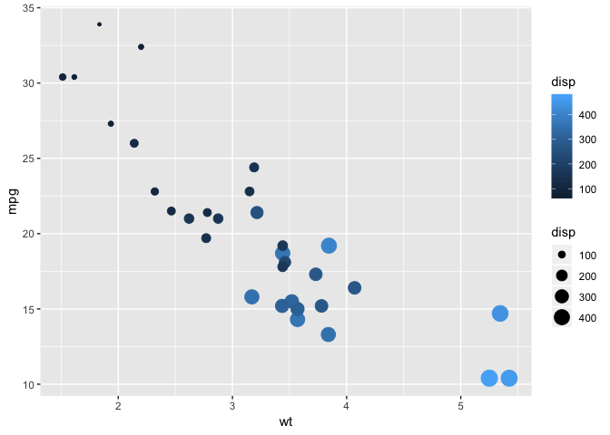<!-- -->

* Shape is only used for categorical data, returns error for continuous data

* `geom_smooth()` add a smooth line over the data


```r
ggplot(diamonds, aes(x = carat, y = price, col=clarity)) +
  geom_smooth()
```

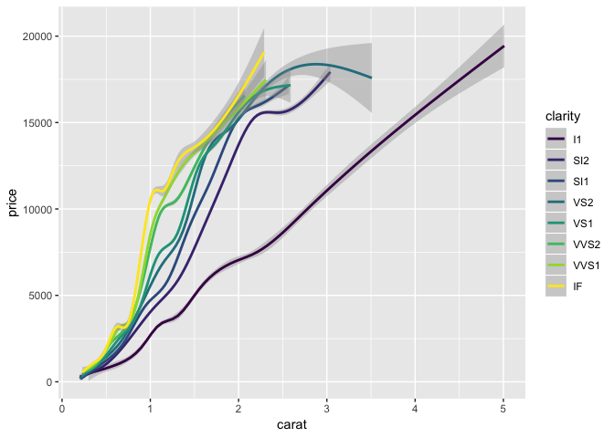<!-- -->

Plots are objects


```r
dia_plot <- ggplot(diamonds, aes(x = carat, y = price))
dia_plot + geom_point(aes(col=clarity))
```

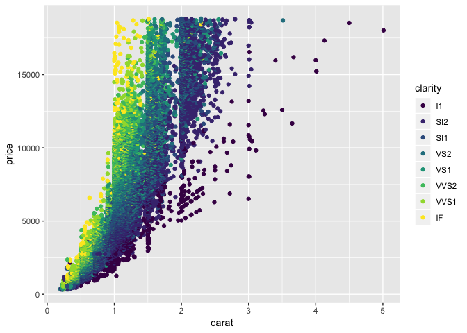<!-- -->

`se` option in `geom_smooth()` is for error shadin

***

##Base R plotting

Factors are simply integer-type vectors


```r
plot(mtcars$wt, mtcars$mpg, col = mtcars$cyl)
```

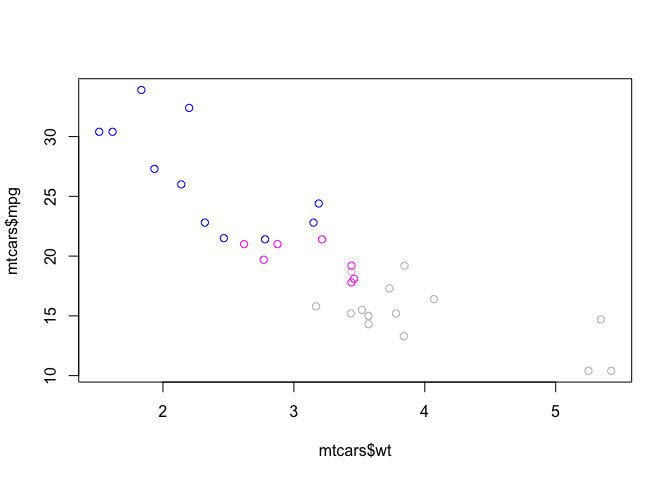<!-- -->

```r
mtcars$fcyl <- as.factor(mtcars$cyl)
plot(mtcars$wt, mtcars$mpg, col = mtcars$fcyl)
```

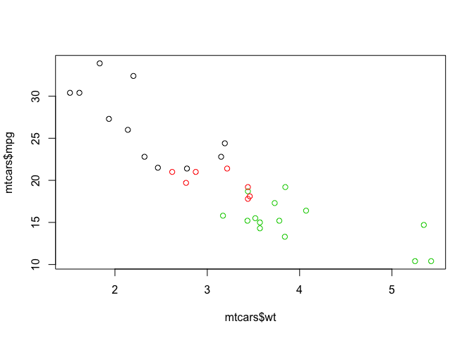<!-- -->

* `lm()` creates linear model and `abline()` plots the linear model

* Use `geom_smooth()` to add line for linear model


```r
mtcars$cyl <- as.factor(mtcars$cyl)
ggplot(mtcars, aes(x = wt, y = mpg, col = cyl)) +
  geom_point() +
  geom_smooth(lm=FALSE, se=FALSE)  +
  geom_smooth(aes(group=1), method = lm, se=FALSE, lty = 2)
```

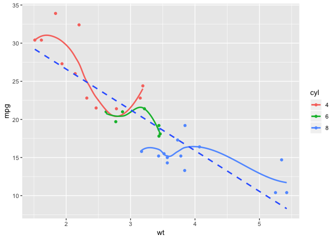<!-- -->

`facet_grid()` splits data into multiple plots based on grouping


```r
library(tidyr)
iris.tidy <- iris %>%
  gather(key, Value, -Species) %>%
  separate(key, c("Part", "Measure"), "\\.")

ggplot(iris.tidy, aes(x = Species, y = Value, col = Part)) +
  geom_jitter() +
  facet_grid(. ~ Measure)
```

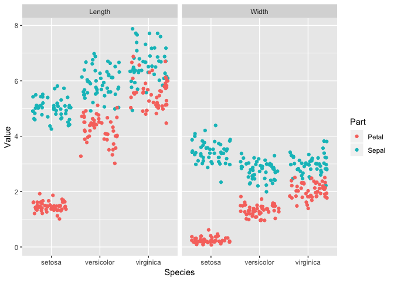<!-- -->

Data manipulation with `tidyr` package.

* `gather()` separates dataframe by categories

* `separate()` splits the key column based on "."


```r
iris$Flower <- 1:nrow(iris)
iris.wide <- iris %>%
  gather(key, value, -Species, -Flower) %>%
  separate(key, c("Part", "Measure"), "\\.") %>%
  spread(Measure, value)

ggplot(iris.wide, aes(x = Length, y = Width, color = Part)) +
  geom_jitter() +
  facet_grid(. ~ Species)
```

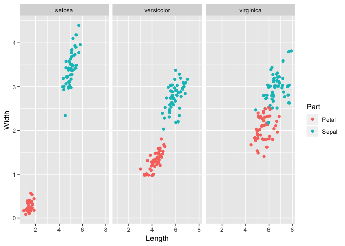<!-- -->

***

##`geom_point()`

Shape and size of the points can be changed


```r
ggplot(mtcars, aes(wt, mpg, col=cyl)) +
  geom_point(shape= 1, size=4)
```

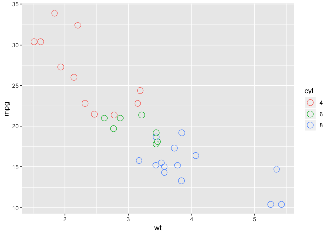<!-- -->

Colors can be cutomized by defining a string of Hex code, e.g.:

```r
my_color <- "#FF6600"
```

`geom_text()` makes a scatterplot of labels

```r
ggplot(mtcars, aes(x = wt, y = mpg, fill = cyl)) + geom_text(label = rownames(mtcars))
```

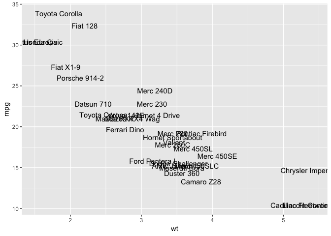<!-- -->

`aes()` can take mathematical calculations as parameters


```r
ggplot(mtcars, aes(x=mpg, y=qsec, col = factor(cyl), shape = factor(am), size = (hp/wt))) +geom_point()
```

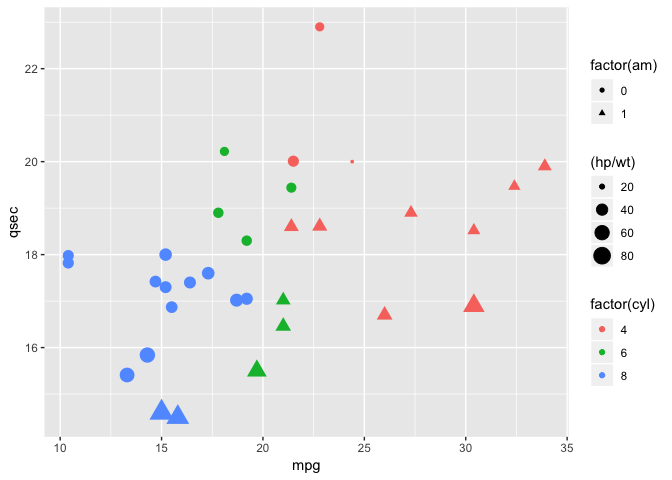<!-- -->

***

##`geom_bar()`
For `geom_bar()`, the `position` parameter will determine the type of bar that will be displayed, there are `"stack"`. `"fill"`, and `"dodge"` types of bars.

***

##`geom_jitter()`


```r
ggplot(mtcars, aes(x = mpg, y = 0)) +
  geom_jitter() +
  scale_y_continuous(limits = c(-2,2))
```

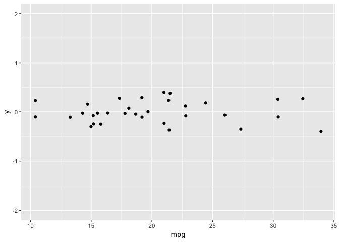<!-- -->

Adjustment for overplotting by changing the transparency of the points (`alpha`)


```r
ggplot(diamonds, aes(x = clarity, y =carat, col=price)) + geom_point(position = "jitter", alpha = 0.5)
```

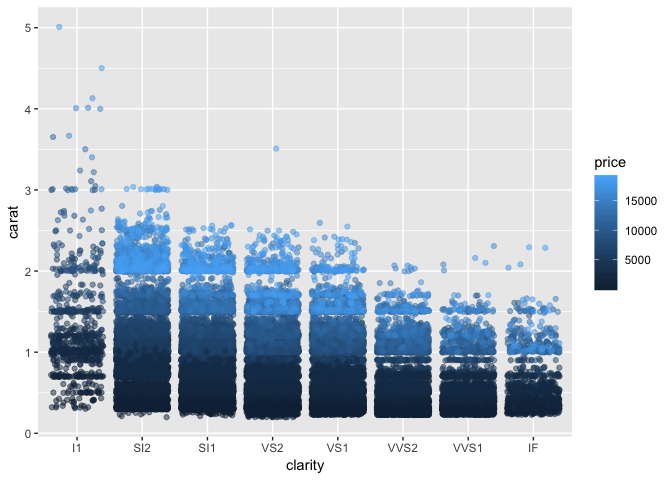<!-- -->

The `jitter` parameter adds random noise to the data to prevent overplotting.


```r
ggplot(mtcars, aes(x = cyl, y = wt)) +
  geom_point(position = position_jitter(0.1))
```

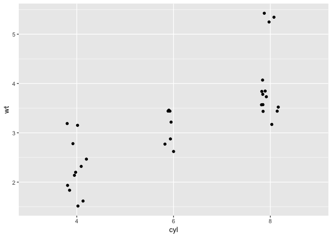<!-- -->

`jitter` can also give you good density visualizations.

Internal data from the data frame can be accessed with `..`

```r
ggplot(mtcars, aes(x = mpg)) +
  geom_histogram(aes(y=..density..), binwidth = 1, fill =  "#377EB8")
```

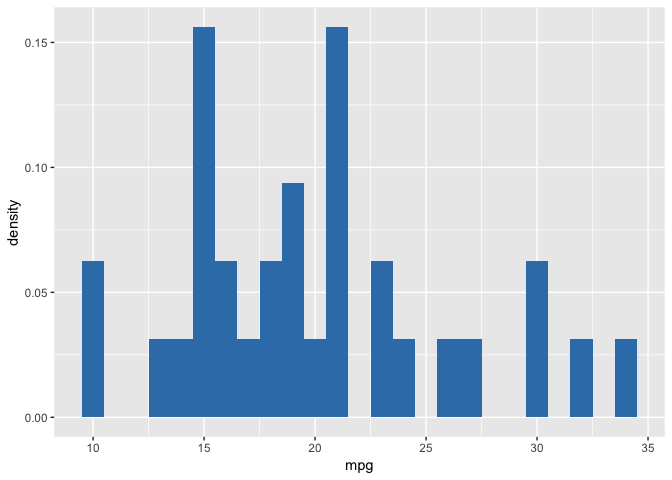<!-- -->

Parameters can also be objects


```r
posn_d <- position_dodge(width =0.2)
ggplot(mtcars, aes(x = cyl, fill = am)) +
  geom_bar(position = posn_d, alpha = 0.6)
```

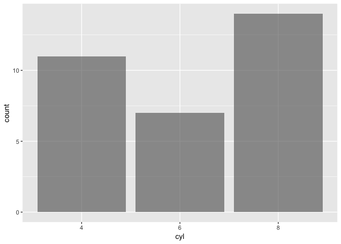<!-- -->

`geom_freqpoly()` Makes a frequency polygon graph

```r
ggplot(mtcars, aes(mpg, col = cyl)) + geom_freqpoly(binwidth = 1)
```

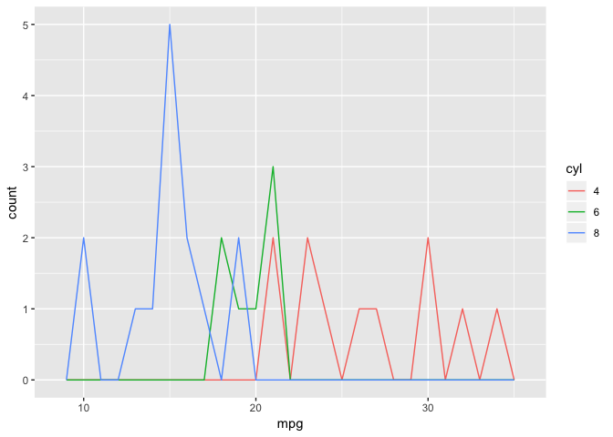<!-- -->

`scale_fill_brewer(palette = "Set1")` lets your apply a plaette of colors onto your graph.

Changing parameters in `geom_histogram()` to produce overlapping histograms

```r
ggplot(mtcars, aes(mpg, fill =cyl)) +
  geom_histogram(binwidth = 1, position = "identity", alpha = 0.4)
```

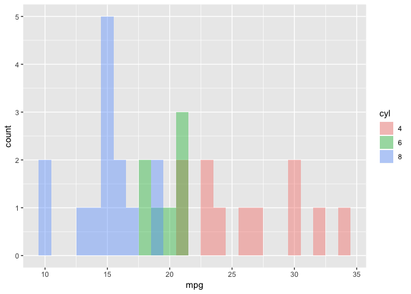<!-- -->


##`geom_line()`
`geom_rect()` can draw highlights to your data (usually specify `ymax` and `ymin` to `Inf` and `-Inf`, respectively)

`gather()` is used to group columns
```
fish.tidy <- gather(fish.species, -Year ,key = Species, value = Capture)
```
