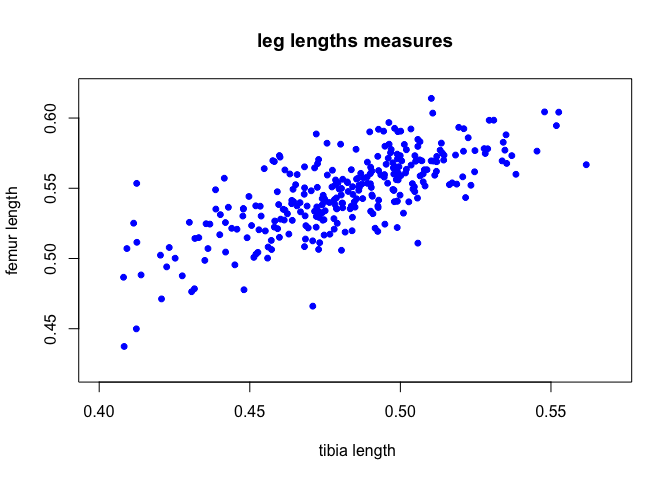

A basic scatter plot

```r
dll_data = read.csv("http://datadryad.org/bitstream/handle/10255/dryad.8377/dll.csv", header=TRUE)

dll_data <- na.omit(dll_data)
dll_data_subset <- dll_data[sample(nrow(dll_data), 300, replace = F),]
plot(femur ~ tibia,
     data = dll_data_subset)
```

<!-- -->

Make a nicer-looking plot

```r
plot(femur ~ tibia,
     pch = 20, # symbol, plot character
     cex = 1.2, # size of symbol, character expand
     col = "blue", # symbol colour
     xlim = c(0.40, 0.57),
     ylim = c(0.42, 0.62),
     xlab = " tibia length",
     ylab = "femur length",
     main = "leg lengths measures",
     data = dll_data_subset)
```

<!-- -->

`dev.off()` Close the connection

* `.png, .tiff` are lossless file formats

* `.jpg` are lossy image formats

