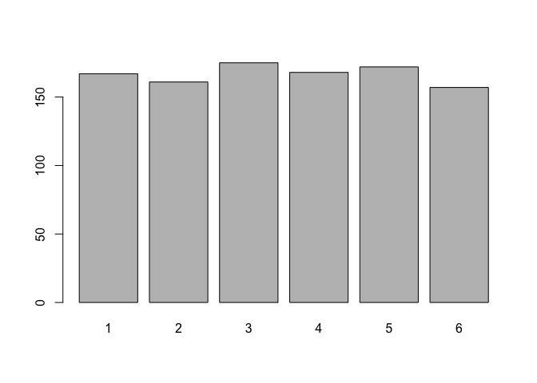
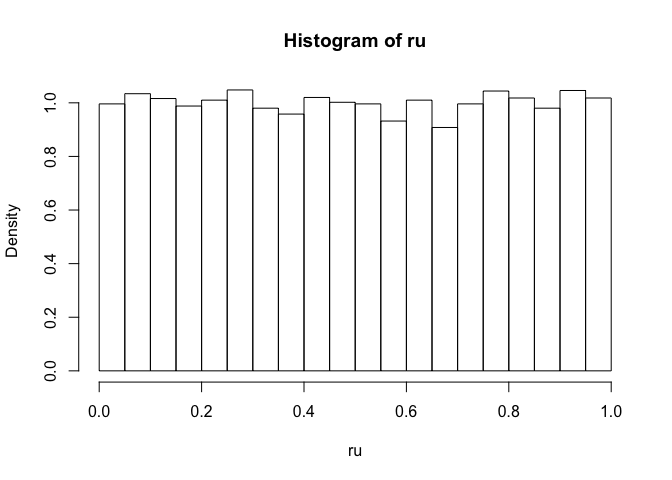
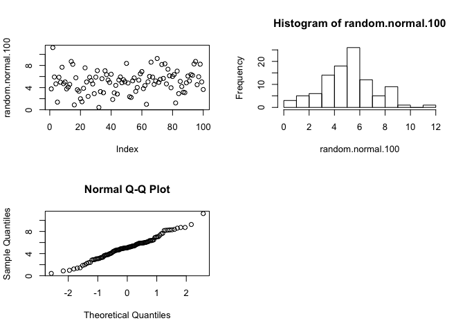
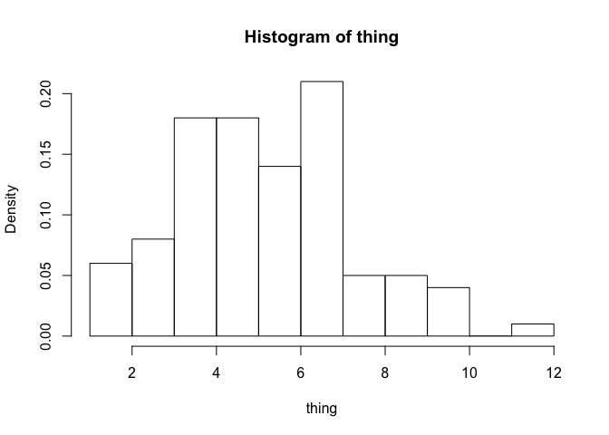
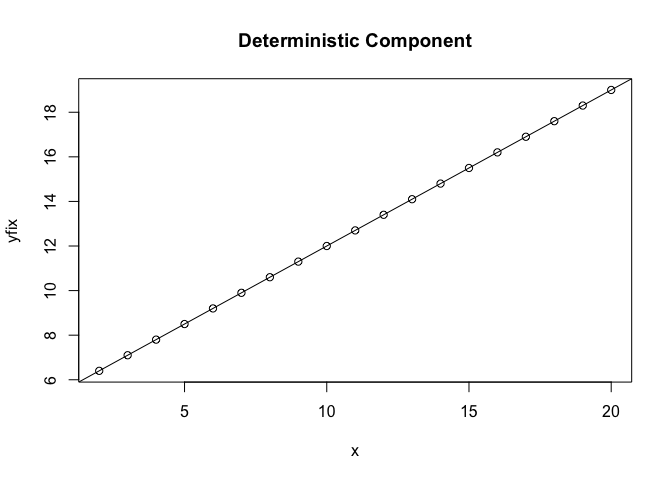
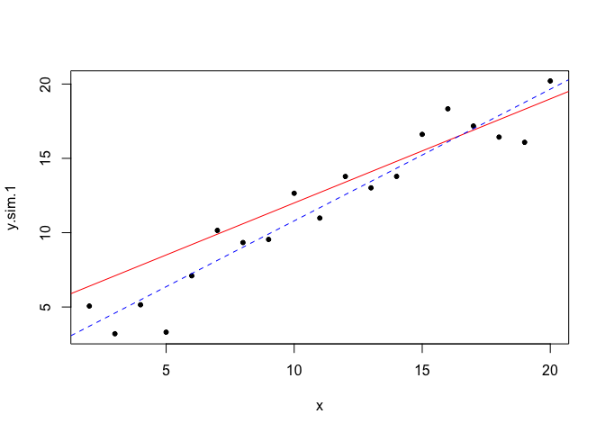
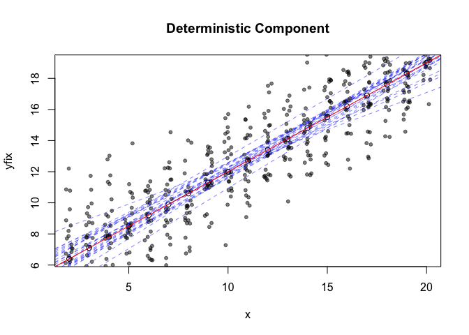

##Stochastic simulations

* The outcome is determined when the math is the same, the model is static, adding sources of variation at various places in model and allowing to \emph{propagate} and influence your models

##Randomness

* There is no true randomness, only \emph{pseudo-random} generation


```r
set.seed(720)
x <- rnorm(1000, mean = 5, sd = 1)
mean(x)
```

```
## [1] 5.01245
```

```r
set.seed(720)
x <- rnorm(1000, mean = 5, sd = 1)
mean(x)
```

```
## [1] 5.01245
```

```r
set.seed(720)
x <- rnorm(1000, mean = 5, sd = 1)
mean(x)
```

```
## [1] 5.01245
```

* It's the same number every time if you set the seed the first time, but if you don't it will continue getting random numbers

* If you don't set the seed, the computer uses the clock on your computer

* Setting the seed is important because you want to be able to make reproducible data for other people

##Rolling the dice


```r
sample(1:6, size = 1 , replace = T , prob = NULL)
```

```
## [1] 3
```

* `sample()` is a function that samples permutations
  + `x` is the thing you want to sample
  + `size` is the number of times you want to sample
  + `replace` toggles sampling with replacement
  + `prob` is the probably of each samples
  
* Usually we are interested in sampling with replacment


```r
replicate(100, sample(1:6, size = 1 , replace = T , prob = NULL))
```

```
##   [1] 4 4 5 3 2 5 2 5 3 3 1 1 6 4 5 3 3 5 3 2 5 6 5 1 6 5 2 3 5 5 1 5 5 4 4
##  [36] 3 2 2 6 4 4 2 2 3 6 1 2 2 6 3 1 6 5 3 4 2 5 4 5 4 3 5 1 4 3 1 5 1 1 4
##  [71] 4 3 5 6 4 5 1 3 3 6 1 6 3 5 6 5 1 2 6 1 4 1 4 4 4 5 5 5 2 5
```


```r
more_rolls <- sample(1:6, size = 1000 , replace = T , prob = NULL)
barplot(table(more_rolls))
```

<!-- -->

* If replace = F, then you can't take a sample larger than the population (6)

##How is sampling useful

* empirical sampling methods

* Randomzation/permutation tests, shuffling the order relative to a treatment variable

* Non-parametric bootstrap -> sampling with replacement

##Modelling genetic drift

* A stochastic sampling of which alleles are transmitted from one generation to the next -> *by random chance*


```r
sampling <- sample(c("A", "a"), size = 40, rep = T, prob = c(0.5, 0.5))
table(sampling)
```

```
## sampling
##  a  A 
## 21 19
```

* Allele frequencies


```r
freq1 <- table(sampling)/length(sampling)
sampling <- sample(c("A", "a"), size = 40, rep = T, prob = freq1)
table(sampling)
```

```
## sampling
##  a  A 
## 25 15
```

##Numerical stochastic simulations

* Simulate numbers to form a probability distribution

* `runif` R uniform, generates a random number between your set ranges 


```r
runif(n = 1, min = 0, max = 1)
```

```
## [1] 0.9146218
```


```r
ru <- runif(n = 10000, min = 0, max = 1)
head(ru)
```

```
## [1] 0.82162498 0.04450114 0.17462692 0.93599464 0.94653824 0.50336970
```

```r
tail(ru)
```

```
## [1] 0.54084832 0.11036862 0.44583783 0.61064196 0.09292294 0.98333432
```

```r
hist(ru, freq = F)
```

<!-- -->


```r
random.normal.100 <- rnorm(n = 100, mean = 5, sd= 2)
par(mfrow = c(2, 2))
plot(random.normal.100)
hist(random.normal.100)
qqnorm(y = random.normal.100)
```

<!-- -->

* `qqplot` comparing data to theoretical distribution


```r
random.normal.100 <- rnorm(n = 100, mean = 5, sd= 2)
thing <- replicate(100, random.normal.100)
hist(thing, freq = F)
```

<!-- -->

##Monte Carlo simulation

* Deterministic part

```r
par(mfrow=c(1,1))
a = 5
b = 0.7
x <- seq(2, 20)
yfix <- a + b*x
plot(yfix ~ x, main = "Deterministic Component")
abline(a = 5, b = 0.7)
```

<!-- -->
* Adding stochastic and random compoenents to the data

* Red = true fit 

* Blue = regression based on simulation


```r
y.sim.1 <- rnorm(length(x), mean = yfix, sd = 2.5)
plot(y.sim.1 ~ x, pch = 20)
abline(a = 5, b = 0.7, col = "red")
y.sim.1.lm <- lm(y.sim.1 ~ x)
abline(reg = y.sim.1.lm, lty = 2, col = "blue")
```

<!-- -->

* Repeat the simulation 25 times


```r
plot(yfix ~ x, main = "Deterministic Component")
for (i in 1:25) {
  x <- seq(2, 20)
  y.sim <- rnorm(length(x), mean = yfix, sd = 2)
  points(y.sim ~ jitter(x), pch = 20, col = rgb(0, 0, 0, alpha = 0.5))
  y.sim.lm <- lm(y.sim ~ x)
  abline(reg = y.sim.lm, lty = 2, col = rgb(0, 0, 1, alpha = 0.5))
}
abline(a = 5, b = 0.7, col = "red")
```

<!-- -->

* Generate 100000 bp sequence


```r
seq1 <- sample(c("A", "T", "C", "G"), 100000, replace = T, prob = rep(0.25, 4))
table(seq1)/length(seq1)
```

```
## seq1
##       A       C       G       T 
## 0.24948 0.24875 0.25169 0.25008
```

* Combine into a string vector


```r
seq1_col <- paste(seq1, collapse = "")
```

##Global regular expressions parser


```r
x <- gregexpr("AACTTTT", seq1_col, fixed = T, useBytes = T)
length(unlist(x))
```

```
## [1] 8
```

* Parameters to speed up search

  + `useBytes` byte by byte comparison, works on any ASCII characters
  + `fixed` look through not everything
